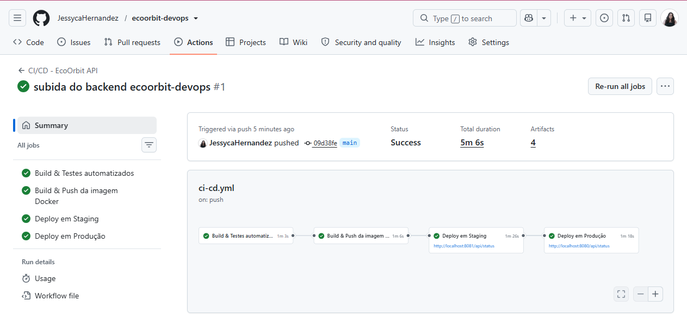
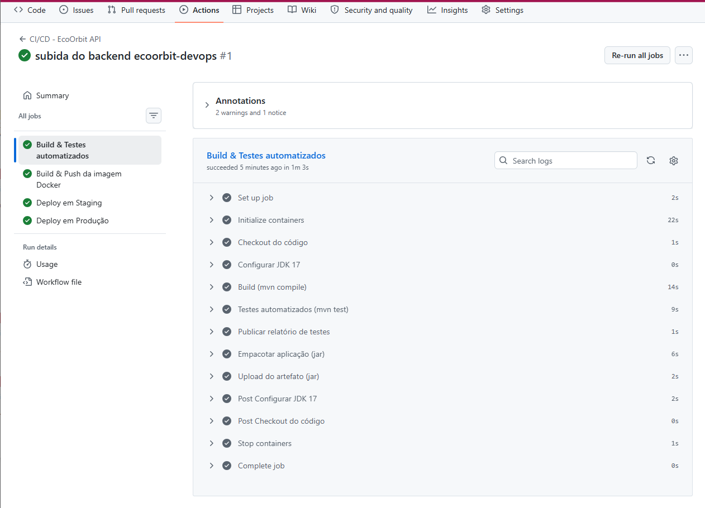
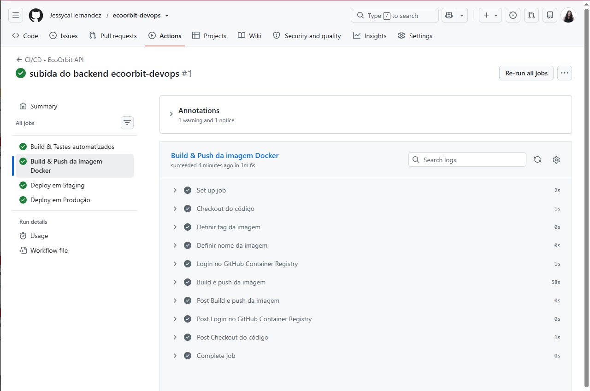
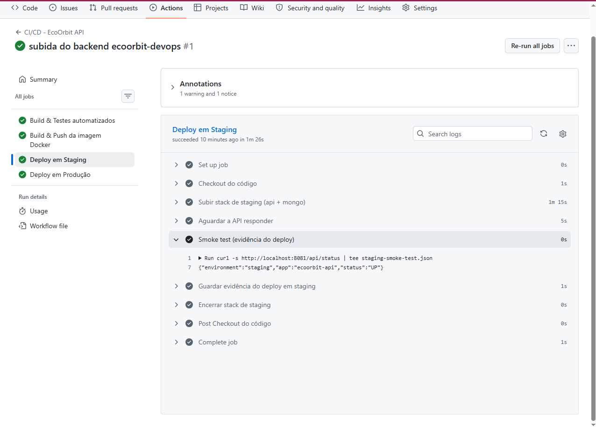
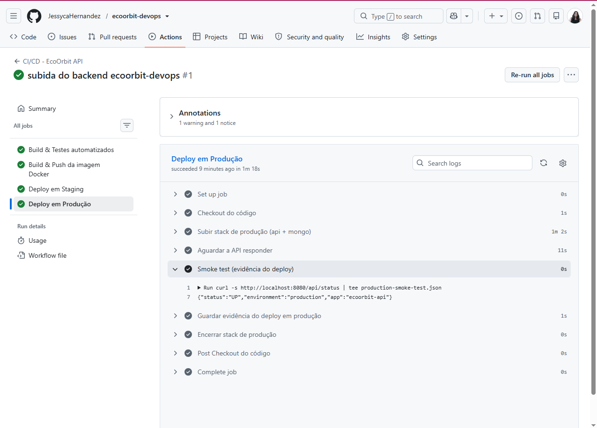
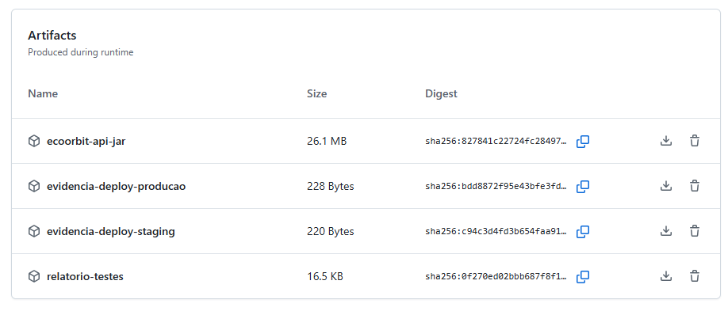
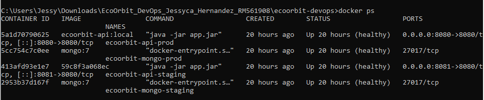
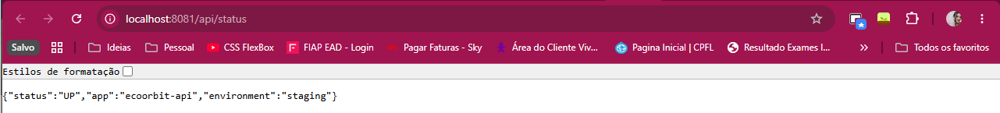
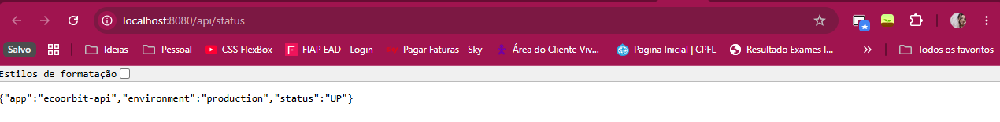

# EcoOrbit - Cidades ESG Inteligentes

Monitoramento Inteligente de Florestas por Satélite - DevOps & CI/CD

**Integrante:** Jéssyca Hernandez - RM 561908

**Atividade:** Navegando pelo mundo DevOps - Pipeline CI/CD, Containerização e Orquestração

---

## 1. Descrição do pipeline de CI/CD

**Ferramenta utilizada:** GitHub Actions, com workflow definido em `.github/workflows/ci-cd.yml`, disparado a cada push nas branches `main`/`develop`, em pull requests para `main`, e manualmente via `workflow_dispatch`.

**Etapas do pipeline:**

1. **build-and-test** - Compila o projeto com Maven, sobe um MongoDB de serviço (container temporário fornecido pelo GitHub Actions) e executa os testes automatizados (JUnit 5 + Spring Boot Test + MockMvc). Publica o relatório de testes e o `.jar` como artefatos.
2. **docker-build-push** - Constrói a imagem Docker (multi-stage build) e publica no GitHub Container Registry (GHCR), com a tag do commit e `latest`.
3. **deploy-staging** - Sobe a stack completa (API + MongoDB) com docker compose usando o override de staging, aguarda a API responder e executa um smoke test como evidência do deploy.
4. **deploy-production** - Executa somente após o sucesso do deploy em staging. Usa o environment `production` do GitHub (que pode exigir aprovação manual de um revisor), sobe a stack com o override de produção e roda o mesmo smoke test.

A separação em dois ambientes (staging e depois produção) segue o requisito de deploy automatizado em dois estágios: produção só roda depois que staging passa, simulando um portão de aprovação antes de ir pro ar de verdade.

## 2. Docker: arquitetura, comandos e imagem criada

A aplicação é empacotada com um **Dockerfile multi-stage**: a primeira etapa usa a imagem `maven:3.9-eclipse-temurin-17` para compilar e empacotar o `.jar`; a segunda etapa copia apenas o `.jar` final para a imagem enxuta `eclipse-temurin:17-jre-alpine`, que roda como usuário não-root e expõe um healthcheck em `/api/status`.

**Arquitetura de containers:** dois serviços orquestrados via Docker Compose, conectados pela rede `ecoorbit-net`: **api** (Spring Boot, porta 8080/8081) e **mongo** (MongoDB 7, com volume nomeado para persistência). O serviço `api` só inicia depois que o `mongo` reporta `healthy`.

**Principais comandos utilizados:**

```
docker compose up -d --build
docker compose -f docker-compose.yml -f docker-compose.staging.yml up -d --build
docker compose -f docker-compose.yml -f docker-compose.prod.yml up -d --build
docker compose logs -f api
docker compose down -v
```

**Imagem criada:** publicada no GitHub Container Registry como `ghcr.io/<usuario>/<repositorio>/ecoorbit-api`, com tags pelo SHA do commit e `latest`.

## 3. Evidência do pipeline rodando (build, testes, deploy)

Execução real, pública e verificável em: [github.com/JessycaHernandez/ecoorbit-devops/actions](https://github.com/JessycaHernandez/ecoorbit-devops/actions) (commit `09d38fe`). Resultado: **Success**, duração total de 5m 6s, 4 artefatos gerados.



| Job | Resultado | Duração |
|---|---|---|
| build-and-test | sucesso | 1m 3s |
| docker-build-push | sucesso | 1m 6s |
| deploy-staging | sucesso | 1m 26s |
| deploy-production | sucesso | 1m 18s |

**Build & Testes automatizados** - compilação com Maven e testes JUnit passando:



**Build & Push da imagem Docker** - build multi-stage e publicação no GHCR:



**Deploy em Staging** - smoke test com resposta real da API:



**Deploy em Produção** - smoke test com resposta real da API:



**Artefatos gerados pelo workflow:**



## 4. Evidência dos ambientes staging e produção funcionando

Staging e produção rodando ao mesmo tempo na máquina local (porta 8081 e 8080):







## 5. Desafios encontrados e como foram resolvidos

**Modelagem flexível do MongoDB**
A collection `leituras_ambientais` tem documentos com campos diferentes conforme o sensor. Resolvido modelando todos os campos possíveis como opcionais na entidade Java, preservando a flexibilidade schema-less do MongoDB.

**Dois ambientes, uma base de código**
Em vez de duplicar o `docker-compose.yml` inteiro, foram usados arquivos de override (`docker-compose.staging.yml` / `docker-compose.prod.yml`), reduzindo duplicação e risco de divergência entre staging e produção.

**Testes sem depender de infraestrutura local**
Os testes de controller usam `@WebMvcTest` com o repositório mockado (Mockito), sem precisar de MongoDB local; o teste de contexto completo roda contra o serviço MongoDB que o próprio GitHub Actions sobe no job de testes.

**Ordem de inicialização dos containers**
O serviço `api` só inicia após o `mongo` reportar `healthy` (`depends_on`/`condition`/`service_healthy`), evitando falhas de conexão na subida da stack.

## 6. Checklist de entrega

| Item | OK |
|---|:--:|
| Projeto compactado em .ZIP com estrutura organizada | X |
| Dockerfile funcional | X |
| docker-compose.yml ou arquivos Kubernetes | X |
| Pipeline com etapas de build, teste e deploy | X |
| README.md com instruções e prints | X |
| Documentação técnica com evidências (PDF ou PPT) | X |
| Deploy realizado nos ambientes staging e produção | X |
